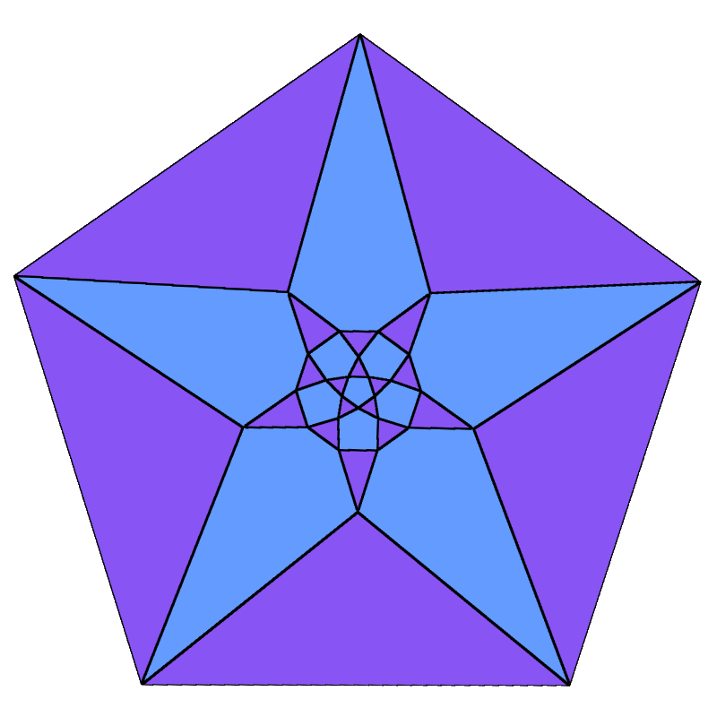

<div style="margin-top: 24px;">
    <h1>
        
        Polyblade
        <a href="https://polyblade.app">
            
        </a>
        <a href="https://github.com/recursivepaws/polyblade/actions/workflows/ci.yml">
            
        </a>
        <a href="LICENSE">
            
        </a>
    </h1>
    <span>Cross-platform application for animating Conway Polyhedron Operations</span>
    <br/>
    <br/>
</div>
<div>
    <p>
        Polyblade makes it easy to visualize and interact with Polyhedra. I believe that the relationships between both primitive and complex polytopes can be more intuitively understood when experienced visually, and this software aims to demonstrate that.
        <br/><br/>
        In particular, emphasis has been placed on making smooth animations for the transitions represented by <a href="https://en.wikipedia.org/wiki/Conway_polyhedron_notation">Conway Polyhedron Notation</a>.
    </p>
    <p>
        <span></span>
        Polyblade runs on <a href="https://github.com/gfx-rs/wgpu">WGPU</a> and <a href="https://github.com/DiouxsLabs/dioxus">Dioxus</a>.
        <br/>
        Using the PST distance algorithm for efficient all pairs shortest paths in the unweighted undirected graphs represented by polyhedra, none of the vertex position data is deterministic. Instead, this distance matrix is used to create spring forces between every node pair $v_i, v_j$ where $v_n \in G$. Proportional to their distance in the graph structure $G$, the springs inflate the polyhedron to proportional size, allowing us to visualize these strucutres even when they break convexity.
        <br/>
    </p>
</div>

## Running

Note that the `webGPU` demo is available [here](https://polyblade.app). It runs just as smoothly as the native application.

### Build from source
To run this software, simply clone the repository and use the dioxus CLI.

```bash
dx serve --platform web
dx serve --platform linux --renderer native
```

#### Conway Roadmap

Due to the recent refactor, we're not as far along on this roadmap as we once were.
Rest assured that in due time we will conquer all shapes.

- [x] Ambo
- [x] Kis
- [x] Truncate
- [ ] Ortho
- [x] Bevel
- [x] Expand
- [x] Dual
- [x] Chamfer
- [x] Snub
- [x] Join
- [ ] Zip
- [x] Gyro
- [ ] Meta
- [ ] Needle

#### Other goals
- [x] Replace all hardcoded presets with prisms, antiprisms, and pyramids that have undergone modification.
- [ ] Implement Vertex Coloring and Edge Coloring
- [ ] Fix Fibonnaci lattice distribution for new shapes
- [ ] Tesselations / tilings using Wythoff
- [ ] "Undo" button
- [ ] Save and load animations and cycles of `Transaction`s
- [x] Schlegel diagrams
- [ ] Color pickers
- [ ] Pokedex entries for polyhedra, point users to wikipedia or polytope wiki when they stumble onto a known entry
  - [ ] Basic functionality
  - [ ] Switch from `RON` to `JSON`
  - [ ] Expand pokedex to include more shapes and improve overlap on isomorphic conway strings
  - [ ] Fix pokedex on WASM
- [ ] Create WASM deployment
  - [x] Fix `time` on web for `dual` and related transitions
  - [ ] WebGL compat
  - [x] WebGPU compat
- [x] Setup some basic CI integrations
